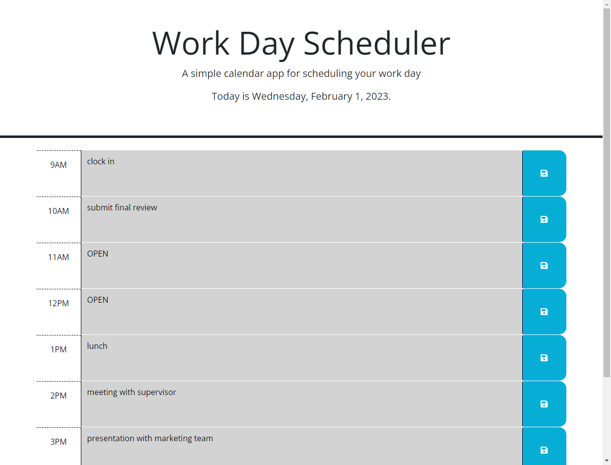
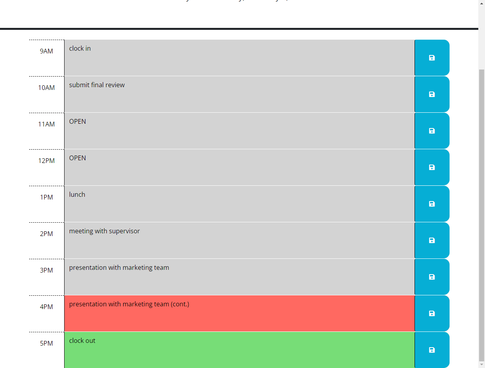

  # Work Day Scheduler

  ## Description
  This project is designed for users to schedule their work tasks throughout the day. The project tracks what tasks have been worked on, currently working on, and need to be worked on by color coding each hour.

  ## Table of Contents
  * [Project Links](#links)
  * [Usage](#usage)
  * [Screenshots](#screenshots)
  * [Credits](#credits)
  * [License](#license)
  * [Contributing](#contributing)
  * [Tests](#tests)
  * [Questions](#questions)

  ## Links
  * [Deployed Application]()
  * [GitHub Repo](https://github.com/jeaustins27/Work-Day-Scheduler)

  ## Usage
Click on the text box with the corresponding hour that you would like to add a task in. Click the blue save button to the right. This will save your task upon every load of the page. Each text box will be color coordinated to correspond with when the task needs/needed to be compeleted. Gray box will mean that the task was due or should have been completed based on your current time. Red box will mean that this is your current task you should be working on based on your current time. A green box will mean that this is a future task to work on based on your current time.

  ## Screenshots
  
  

  ## Credits
  * [W3Schools](https://www.w3schools.com/)
  * [Readme.so](https://readme.so/)
  * [Stack Overflow](https://stackoverflow.com)

  
  ## License
  
  
  This project is licensed under the [MIT](https://choosealicense.com/licenses/mit/) license.

    

  ## Contributing
  You can help with contributing by reaching me via email.

  ## Tests
  There are no tests to be ran

  ## Questions
  If you have any questions you can reach out via [Email](mailto:JeaustinS27@gmail.com) or you can check out my GitHub profile at here: [GitHub](https://github.com/jeaustins27)

